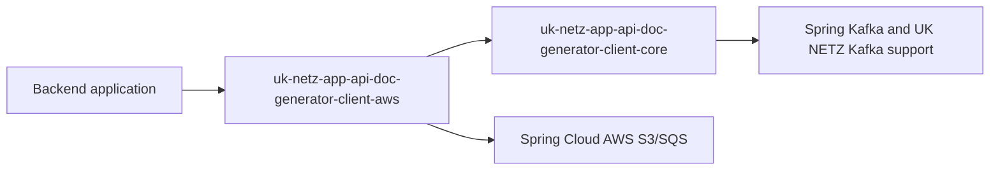
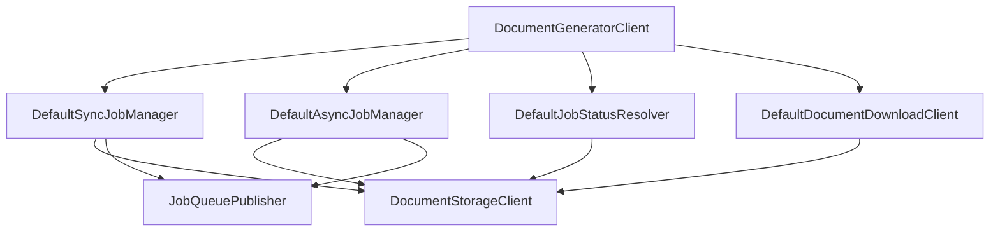
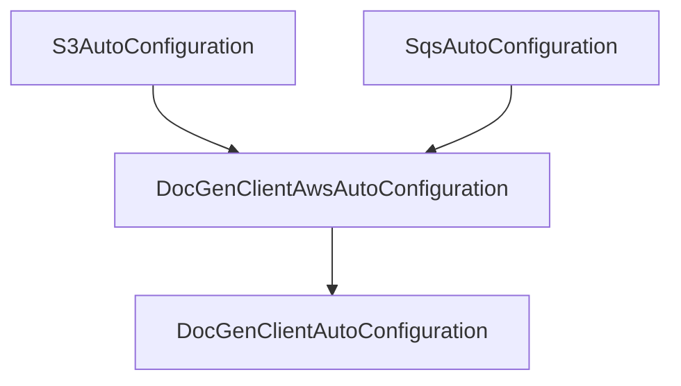

# Architecture

The library is split into a provider-neutral core and concrete provider adapters. Backend applications depend on an adapter artifact, while most implementation and public API concepts live in the core module.

## Module Boundary



The core module owns:

- public facades and manager interfaces
- sync and async orchestration
- Kafka result-consumer logic
- provider-neutral storage and queue contracts
- object key and status marker conventions
- Spring Boot auto-configuration for core beans

The AWS module owns:

- S3 storage implementation
- SQS queue publisher implementation
- AWS-specific auto-configuration
- LocalStack-backed integration coverage

## Dependency Rule

The core module must not depend on AWS SDK or Spring Cloud AWS packages. This is enforced by `ArchitectureTest` with an ArchUnit rule that rejects dependencies on `software.amazon..` and `io.awspring.cloud..`.

This rule protects the core API from becoming tied to one infrastructure provider. New provider support should be added as another adapter module that implements `DocumentStorageClient` and `JobQueuePublisher`.

## Core Design

The central design choice is that orchestration talks only to `DocumentStorageClient` and `JobQueuePublisher`.



`DocumentGeneratorClient` is the consumer-facing contract. It exposes blocking sync submission, async submission, status lookup, and download methods while keeping the lower-level orchestration components internal to the core module.

## Shared Runtime Contract

The library and document generator worker communicate through storage objects and queue messages. These are not internal implementation details; changing them requires coordinated changes in the worker and consumer documentation.

| Object | Key |
| --- | --- |
| Input DOCX | `input/{jobId}.docx` |
| Status marker | `status/{jobId}/{marker}` |
| Output PDF | `output/{jobId}.pdf` |
| Error detail | `output/{jobId}.error.json` |

Queue messages use this JSON shape:

```json
{
  "jobId": "job-id",
  "normalize": true,
  "metadata": {
    "requestId": "request-123"
  }
}
```

The worker derives object keys from `jobId`. `normalize` is optional, defaults to false, and is omitted from JSON when false. `metadata` is optional business context and is omitted from JSON when empty. The SQS `MessageGroupId` is transport metadata derived from `docgen.client.message-group-id` and priority (`-high` or `-low`), so it is not serialized in this JSON.

## Status Model

Status is represented by a combination of terminal output objects and marker objects. Rows are evaluated in order, so terminal output objects win over marker objects and a PDF wins over an error object.

| Signal | State |
| --- | --- |
| `output/{jobId}.pdf` exists | `COMPLETE` |
| `output/{jobId}.error.json` exists | `FAILED` |
| `status/{jobId}/processing` exists | `PROCESSING` |
| `status/{jobId}/submitted` exists | `QUEUED` |
| `status/{jobId}/submission_failed` exists | `SUBMISSION_FAILED` |
| `status/{jobId}/uploaded` exists | `PENDING` |
| no known signal exists | `NOT_FOUND` |

`DefaultJobStatusResolver` deliberately checks terminal output first. If both a PDF and an error object exist, the PDF wins and the job is reported as complete.
`SUBMISSION_FAILED` is returned only when no terminal output object is present.

## Auto-Configuration Layers

Spring Boot discovers auto-configuration from each module's `META-INF/spring/org.springframework.boot.autoconfigure.AutoConfiguration.imports`.

The AWS auto-configuration runs after Spring Cloud AWS S3/SQS auto-configuration and before the core client auto-configuration. This lets the AWS module contribute generic `DocumentStorageClient` and `JobQueuePublisher` beans before the core module decides whether it can create the client facade and managers.



## Extension Points

The intended extension points are:

- `ConversionResultHandler` for backend-specific async event processing.
- `DocumentStorageClient` and `JobQueuePublisher` inside provider adapter modules.
- Spring bean overrides for advanced integration tests or specialized deployments.

Backend applications should normally not implement provider-specific storage or queue beans directly. If a provider is missing, add a module to this repository so the adapter is tested and documented with the rest of the library.
