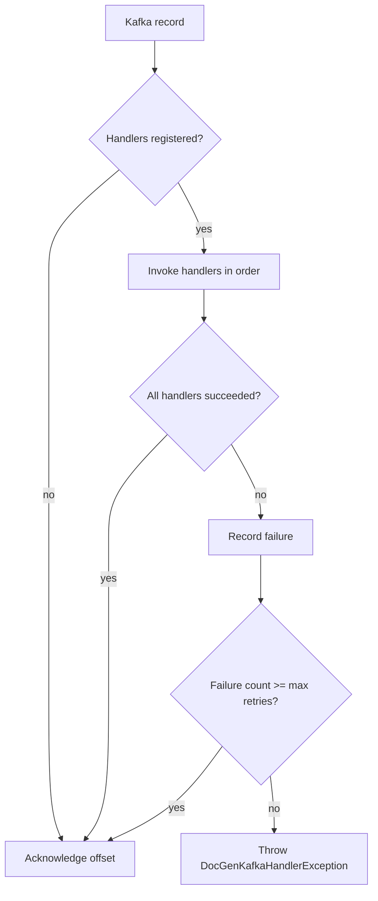

# Kafka Result Consumer

The Kafka result consumer is optional. It is used for asynchronous document-generation flows where the worker publishes conversion events after processing.

## Enablement

Set:

```properties
kafka.docgen-consumer.enabled=true
```

The consumer listens to:

```text
${kafka.docgen-consumer.topic:doc.converted}
```

with group:

```text
${kafka.docgen-consumer.group:app-api-doc-result-consumer}
```

## Event Shape

The consumer expects values that deserialize to `ConversionEvent`:

```json
{
  "jobId": "job-id",
  "status": "COMPLETE",
  "outputS3Key": "output/job-id.pdf",
  "errorReason": null,
  "durationMs": 1250,
  "metadata": {
    "requestId": "request-123"
  }
}
```

`outputS3Key` is retained for compatibility with the current worker contract. Consumers should treat it as the output object key.
`metadata` is optional business context copied from the submitted job message. It is omitted when empty and deserializes to an empty map.

## Handler Dispatch

Backends register one or more `ConversionResultHandler` beans.

```java
@Component
@Order(100)
class PersistResultHandler implements ConversionResultHandler {

    @Override
    public void handle(ConversionEvent event) {
        // Persist status, output object key, error reason, or metadata.
    }
}
```

`DocGenKafkaResultConsumer` copies and sorts handlers using Spring's `AnnotationAwareOrderComparator`, so `@Order`, `Ordered`, and related Spring ordering mechanisms apply.

Handlers must be idempotent. A handler can be called more than once for the same event when another handler fails and the Kafka record is retried.

## Offset Commit Policy

The listener container factory is configured with:

- `AckMode.MANUAL_IMMEDIATE`
- synchronous commits
- `enable.auto.commit=false`
- a `DefaultErrorHandler` with zero delay and effectively unlimited attempts

The consumer acknowledges the record only when:

- no handlers are registered
- all handlers run successfully
- the event reaches the configured poison-event threshold

If any handler fails before the poison threshold is reached, the consumer throws `DocGenKafkaHandlerException`. The record is not acknowledged and Spring Kafka retries it.



## Poison-Event Tracking

`DocGenKafkaPoisonEventTracker` keys failures by:

- topic
- partition
- offset
- job ID

The failure count is cleared after successful handling or after the poison event is acknowledged and skipped.

`docgen.client.max-handler-retries` controls the threshold. The default is `3`, so the third failed delivery of the same topic, partition, offset, and job ID is treated as poison. When the threshold is reached, the consumer logs the topic, partition, offset, job ID, and failure count at `ERROR` before acknowledging the record.

## Handler Failure Semantics

The consumer invokes all handlers even if an earlier handler fails. Each handler exception is logged at `WARN` before the record is retried. This lets independent handlers make progress, but it also means handlers must tolerate duplicate execution on retry.

Recommended handler behavior:

- use job ID as an idempotency key
- write terminal state transitions defensively
- avoid creating duplicate file records
- treat unknown statuses as domain failures or ignored events according to application policy
- keep long-running downloads or persistence failures visible by throwing an exception

## Correlation Interceptors

When Kafka result-consumer support is enabled, the auto-configuration creates default UK NETZ correlation interceptors if the application has not supplied them.

`DocGenKafkaCorrelationParentHeaderProducerInterceptor` is currently a no-op implementation. It exists to satisfy the UK NETZ Kafka producer factory contract for this consumer path.
