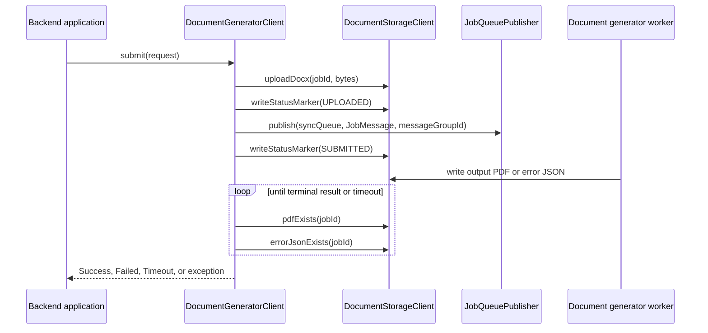
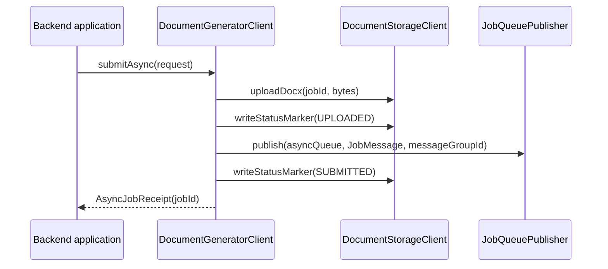
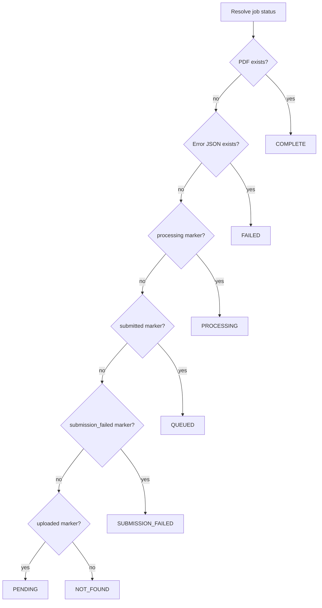

# Runtime Flows

Runtime behavior is driven by deterministic object keys, status markers, and queue messages. The library does not call the document generator worker directly.

## Object Keys

`DocumentObjectKeys` centralizes every key used by the client.

| Method | Key |
| --- | --- |
| `inputDocx(jobId)` | `input/{jobId}.docx` |
| `statusPrefix(jobId)` | `status/{jobId}/` |
| `statusMarker(jobId, marker)` | `status/{jobId}/{marker}` |
| `outputPdf(jobId)` | `output/{jobId}.pdf` |
| `errorJson(jobId)` | `output/{jobId}.error.json` |

The methods reject blank job IDs. Keep new code using `DocumentObjectKeys` instead of assembling keys manually.

## Synchronous Submission

`DocumentGeneratorClient.submit(DocumentGenerationRequest)` blocks until a PDF appears, an error JSON appears, or the sync timeout is reached. Set `normalize=true` on the request to request DOCX normalization. Set request metadata to include optional business context in the queue message. Priority defaults to `HIGH` when omitted or set to `null`; `LOW` is also supported. It returns a `ConversionResult` for document-generation outcomes and throws for infrastructure failures.

Important behavior:

- Job IDs are generated with UUIDs in production auto-configuration.
- The caller thread polls storage using `docgen.client.sync-poll-interval`.
- The maximum wait is `docgen.client.sync-timeout`.
- Queue publish failure writes `SUBMISSION_FAILED` through `SubmissionFailureMarkingJobQueuePublisher` and rethrows the publish exception.
- `docgen.client.message-group-id` is required before upload; the client publishes `{base}-high` for `HIGH` and `{base}-low` for `LOW`.
- Supplied metadata is serialized on the queue message and omitted from JSON when empty.
- Supplied `normalize=true` is serialized on the queue message. `normalize=false` is the default and is omitted from JSON.
- Failure to write the `SUBMITTED` marker is logged but does not fail submission once the queue message has been published.

## Sync Result Mapping

| Storage signal | Result |
| --- | --- |
| PDF object exists | `ConversionResult.Success(jobId, outputObjectKey)` |
| Error JSON exists | `ConversionResult.Failed(jobId, errorReason)` |
| Error JSON exists with blank reason | `ConversionResult.Failed(jobId, "Document generation failed")` |
| No terminal object before timeout | `ConversionResult.Timeout(jobId)` |
| Upload, queue publish, storage inspection, or wait interruption throws | runtime exception |

The result indicates the conversion outcome. Infrastructure failures are thrown because they usually need retry or operational handling by the caller. Consuming backends should map these failures to soft user-facing retry errors.

## Asynchronous Submission

`DocumentGeneratorClient.submitAsync(DocumentGenerationRequest)` uploads the DOCX, publishes an async queue message, writes markers, and returns an `AsyncJobReceipt`. Set `normalize=true` on the request to request DOCX normalization. Set request metadata to include optional business context. Priority defaults to `HIGH`.

The backend owns persistence of the returned `jobId` and any mapping to domain records. The async submission method does not wait for the document generator worker.

Queue publish failures are rethrown. As with sync submission, the queue wrapper attempts to write `SUBMISSION_FAILED` before rethrowing. Request, DOCX bytes, and `docgen.client.message-group-id` validation happens before upload so invalid submissions do not leave orphaned input objects.

## Status Resolution

`DocumentGeneratorClient.getStatus(String)` reads output objects and status markers through `DocumentStorageClient`.
Signals are evaluated in precedence order: terminal output objects win over markers, and a PDF wins over an error object.

`submittedAt` is taken from the latest `SUBMITTED` marker timestamp when available.
`SUBMISSION_FAILED` is returned only when no terminal output object is present.

## Download Behavior

`DocumentGeneratorClient` delegates download behavior to storage:

- `downloadBytes(jobId)` calls `DocumentStorageClient.downloadPdf(jobId)`.
- `createDownloadUrl(jobId, expiry)` uses the provided expiry or `docgen.client.download-url-expiry`.
- If a provider returns `Optional.empty()` for signed URL creation, the client throws `DocGenDownloadException`.

The AWS adapter supports signed URLs through Spring Cloud AWS `S3Operations.createSignedGetURL`.
